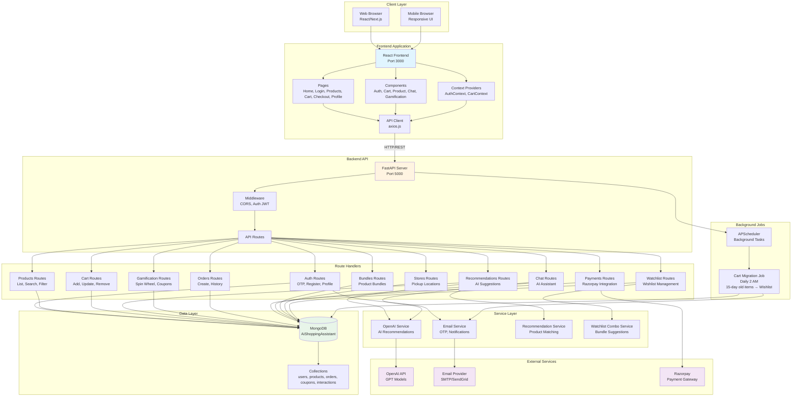
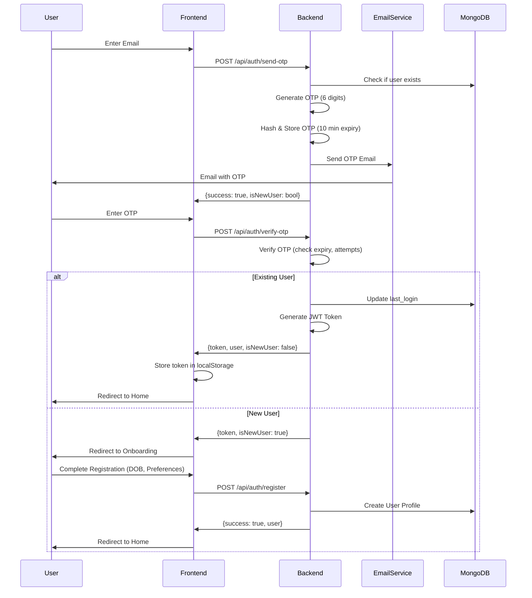
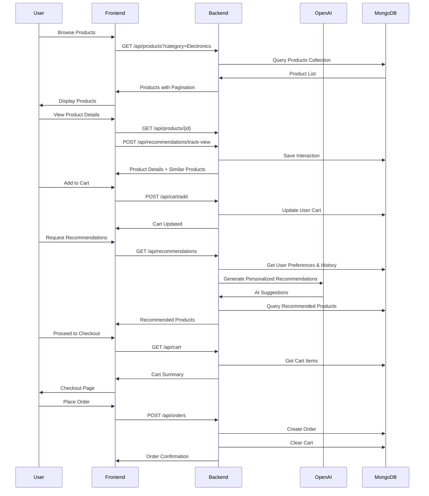
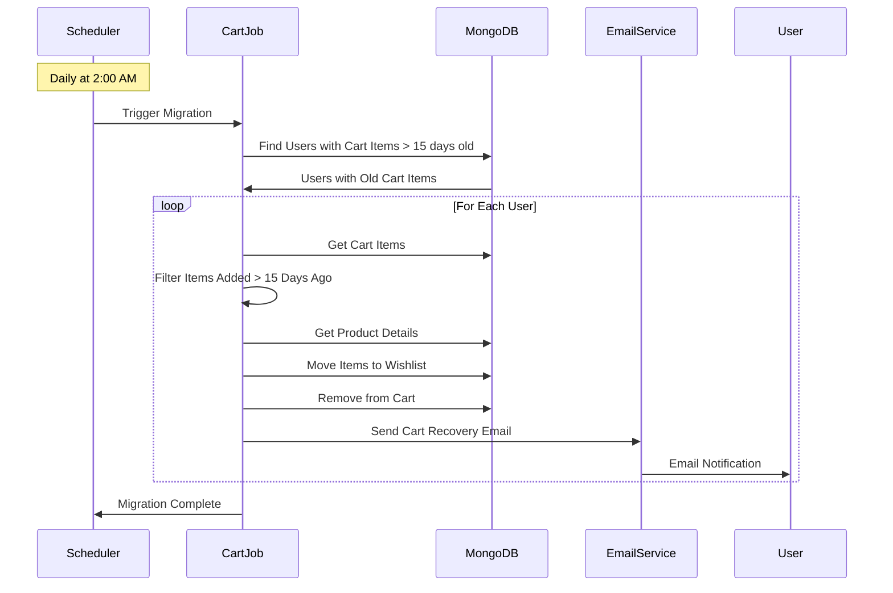
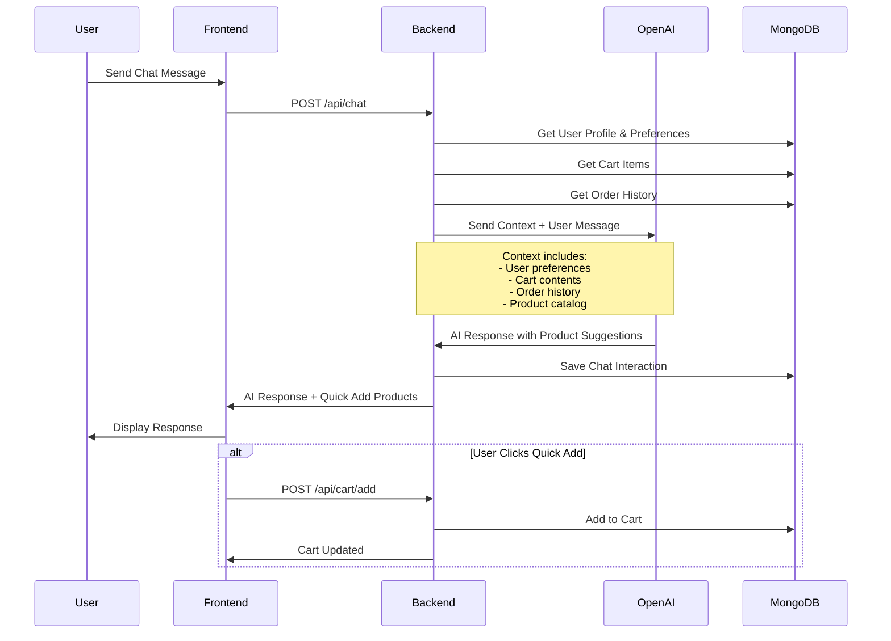
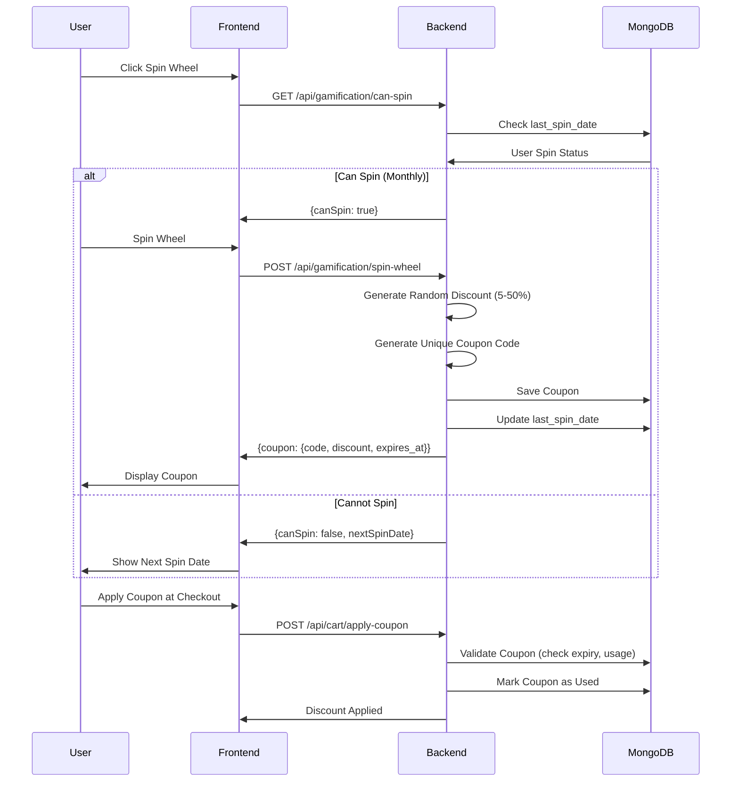
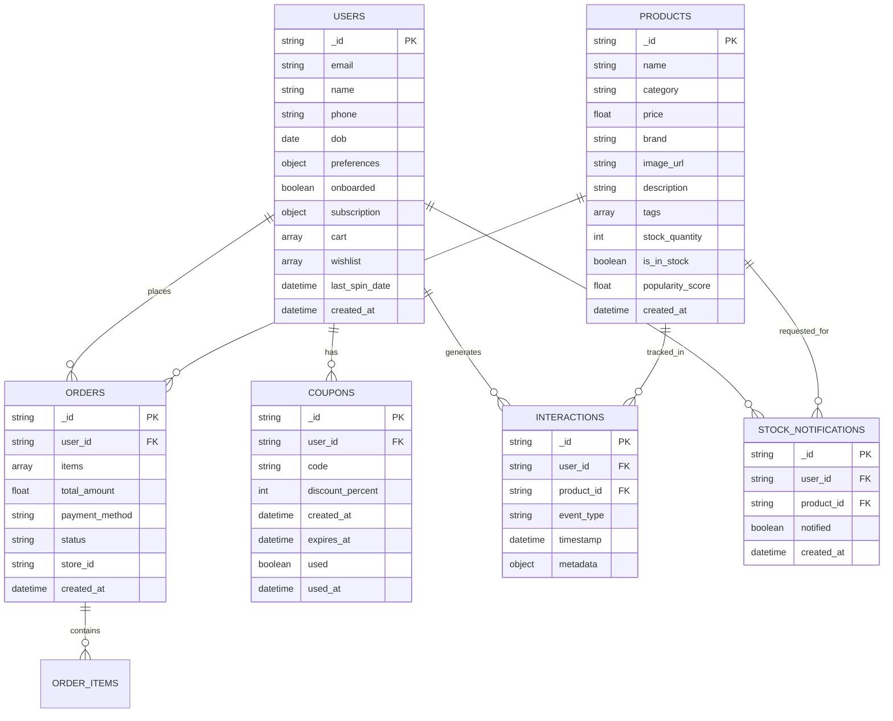

# AI Retail Assistant - Architecture Diagram

## System Architecture Overview



## Authentication Flow



## Shopping Workflow



## Cart Migration Background Job Flow



## AI Chat Assistant Flow



## Gamification Flow



## Database Schema Overview



## Technology Stack

### Frontend
- **Framework**: React with React Router
- **UI Library**: Material-UI (MUI)
- **State Management**: React Context API (AuthContext, CartContext)
- **HTTP Client**: Axios
- **Build Tool**: Vite/Next.js
- **Styling**: CSS Modules, Material-UI Theme

### Backend
- **Framework**: FastAPI (Python)
- **Database**: MongoDB (Motor async driver)
- **Authentication**: JWT (python-jose)
- **Background Jobs**: APScheduler
- **AI Integration**: OpenAI API
- **Email Service**: SMTP/SendGrid

### External Services
- **AI**: OpenAI GPT Models
- **Email**: SMTP (Gmail) / SendGrid
- **Payment**: Razorpay
- **Database**: MongoDB Atlas / Local MongoDB

## Key Features Architecture

### 1. Product Catalog
- **Search & Filter**: Category, price range, stock status
- **Pagination**: Efficient data loading
- **Product Details**: Full product information with similar products

### 2. Shopping Cart
- **Real-time Updates**: Immediate cart synchronization
- **Auto-migration**: 15-day old items moved to wishlist
- **Recovery System**: Email notifications for migrated items

### 3. AI Recommendations
- **Personalized**: Based on user preferences and history
- **Context-aware**: Considers cart, orders, and interactions
- **OpenAI Integration**: GPT-powered suggestions

### 4. Gamification
- **Monthly Spin Wheel**: Discount coupons (5-50%)
- **Coupon Management**: Track usage and expiry
- **Points System**: Daily check-ins and streaks

### 5. Chat Assistant
- **AI-powered**: OpenAI GPT integration
- **Context-aware**: Knows user preferences and cart
- **Quick Actions**: Direct product additions from chat

### 6. Order Management
- **Multiple Payment Methods**: Pay at store / Online (Razorpay)
- **Store Pickup**: Location-based store selection
- **Order History**: Complete purchase tracking

## API Endpoints Summary

```
/api/auth/*
  - POST /send-otp
  - POST /verify-otp
  - POST /register
  - GET /me
  - PUT /profile

/api/products/*
  - GET / (list with filters)
  - GET /{id}
  - GET /category/{category}
  - POST /notify-me

/api/cart/*
  - GET /
  - POST /add
  - PUT /{product_id}
  - DELETE /{product_id}
  - GET /recovery
  - POST /clear

/api/recommendations/*
  - GET /
  - POST /track-view
  - GET /similar/{product_id}

/api/gamification/*
  - POST /spin-wheel
  - GET /my-coupons
  - POST /use-coupon/{code}
  - GET /can-spin

/api/orders/*
  - GET /
  - POST /
  - GET /{order_id}
  - GET /history

/api/payments/*
  - POST /create-order
  - POST /verify

/api/chat
  - POST /

/api/bundles/*
  - GET /
  - GET /product/{product_id}

/api/stores/*
  - GET /pickup

/api/watchlist/*
  - GET /
  - GET /combo-suggestions/{product_id}
  - POST /move-from-cart/{product_id}
```

## Security Architecture

1. **Authentication**: JWT tokens with expiration
2. **OTP Security**: Hashed storage, 10-minute expiry, 5 attempt limit
3. **CORS**: Configured for specific frontend origins
4. **Input Validation**: Pydantic models for all inputs
5. **Protected Routes**: Middleware-based JWT verification

## Deployment Considerations

- **Frontend**: Static hosting (Vercel, Netlify)
- **Backend**: Containerized (Docker) or serverless
- **Database**: MongoDB Atlas (cloud) or self-hosted
- **Background Jobs**: Separate worker process or serverless functions
- **Environment Variables**: Secure configuration management
- **Monitoring**: Health checks, logging, error tracking
